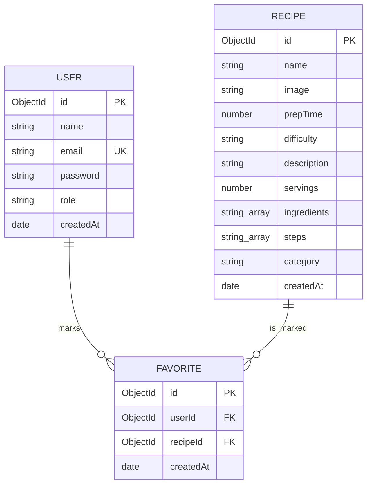

# RecipeBook - Sweet Bakery & Dessert Catalog

RecipeBook is a modern, responsive, and visually appealing web application designed for exploring, managing, and sharing sweet bakery and dessert recipes. The platform provides a rich user experience featuring interactive recipe catalogs, user authentication, a customizable favorites list, multi-language support (Spanish and English), and an administrative control panel equipped with system metrics and email broadcast features.

The application leverages a clean separation of concerns, maintaining strict boundaries between client-side interactive elements and server-side business logic, database queries, and secure API endpoints.

---

## Table of Contents

1.  *Tech Stack & Core Libraries*
2.  *Key Features*
3.  *Architecture & Directory Structure*
4.  *Execution Contexts (Client vs. Server)*
5.  *Database Schema & Relations*
6.  *API Reference*
7.  *SMTP & Email Setup*
8.  *Getting Started & Installation*
9.  *Environment Configuration*
10. *Development & Production Workflow*

---

## 1. Tech Stack & Core Libraries

RecipeBook is built using modern web development technologies to ensure high performance, security, and a premium visual aesthetic.

*   **Framework:** Next.js (App Router, version 16.2.9) with Turbopack for compilation.
*   **Database:** MongoDB, using Mongoose (version 9.7.2) for object modeling, validation, and connection caching.
*   **Authentication:** NextAuth.js (version 5.0.0-beta) configured with a secure Credentials Provider and password hashing via bcryptjs.
*   **Styling:** Tailwind CSS (version 4) for responsive utility-first layouts, custom components, and color variables.
*   **Icons:** Lucide React (version 1.21.0) for vector iconography.
*   **Animations:** Framer Motion (version 12.40) and interactive Spline 3D viewport canvas.
*   **Email Services:** Nodemailer (version 7.0.13) for handling automated SMTP and Google OAuth2 email transport.
*   **Internationalization:** Custom state-based React Context provider mapping JSON dictionaries for Spanish and English.

---

## 2. Key Features

### Recipe Explorer
*   A responsive catalog grid displaying recipe cards.
*   Interactive details for each recipe card: name, preparation time, difficulty level, short description, and category.
*   Catalog-level search filter and difficulty categories.

### Detailed Recipe View
*   Dynamic routing for recipe detail pages (`/recipes/[id]`).
*   Displays preparation times, serving size adjusters, and categorized ingredients lists.
*   Step-by-step instructions accompanied by checklist inputs for the user.

### Favorites Management
*   Authenticated users can mark recipes as favorites with an interactive, animated heart selector.
*   Dedicated `/favorites` view displaying the user's custom selection, populated dynamically from the database.

### Internationalization (i18n)
*   Full client-side translation of headers, cards, buttons, messages, validation text, and details.
*   Persists language choice (ES/EN) in both the browser's `localStorage` and a secure cookie for server-side middleware alignment.

### Authentication & Access Control
*   User registration with real-time password strength indicators (weak, medium, strong) and confirmation validation checks.
*   Secure login using encrypted session cookies (JWT strategy).
*   Role-based routing (Admin vs. User) powered by a custom Next.js middleware proxy.

### Admin Dashboard
*   Aggregated table listing all registered users and the quantity of recipes they have marked as favorites.
*   Interactive drawer/expansion to inspect the exact names of the recipes favorited by any specific user.
*   Administrative email broadcast system to dispatch system updates or welcome notes to users.

---

## 3. Architecture & Directory Structure

```
├── public/                 # Static assets, fonts, and icons
├── src/
│   ├── app/                # Next.js App Router (Pages, Layouts, API Handlers)
│   │   ├── (auth)/         # Grouped authentication routes (login, register)
│   │   ├── admin/          # Administrator dashboard page
│   │   ├── api/            # Backend REST API endpoints
│   │   │   ├── admin/      # Admin endpoints (favorites aggregation, broadcast)
│   │   │   ├── auth/       # Registration and NextAuth routing
│   │   │   ├── favorites/  # User-specific favorites endpoints
│   │   │   └── recipes/    # Recipe query and seed endpoints
│   │   ├── favorites/      # User favorites catalog page
│   │   ├── recipes/        # Recipe detail dynamic page
│   │   ├── layout.tsx      # Main application entry point and providers
│   │   └── page.tsx        # Homepage (Recipe catalog)
│   ├── components/         # Reusable UI components
│   │   ├── illustrations/  # Presenter components displaying SVG vectors
│   │   └── RecipeCard.tsx  # Interactive recipe display card
│   ├── context/            # React context providers
│   │   └── I18nContext.tsx # Translation state and hook definition
│   ├── lib/                # Shared utilities
│   │   ├── auth.ts         # NextAuth configuration and callbacks
│   │   └── db.ts           # MongoDB connection manager and cache
│   ├── locales/            # JSON translation dictionary files
│   │   ├── en.json         # English translations
│   │   └── es.json         # Spanish translations
│   ├── models/             # Mongoose schemas
│   │   ├── Favorite.ts     # User-to-Recipe mapping
│   │   ├── Recipe.ts       # Recipe attributes and structure
│   │   └── User.ts         # User credentials and metadata
│   ├── services/           # Backend database query layers
│   │   ├── email.service.ts    # Nodemailer transport setup and dispatch
│   │   ├── favorite.service.ts # Favorite toggle and retrieval
│   │   ├── recipe.service.ts   # Recipe queries and initial seeding
│   │   └── user.service.ts     # Registration, encryption, and admin lists
│   ├── types/              # TypeScript interface definitions
│   │   ├── index.ts        # Common domain entities
│   │   └── next-auth.d.ts  # NextAuth types extensions
│   └── proxy.ts            # Next.js middleware router interceptor
├── .env.local              # Local environment overrides
├── eslint.config.mjs       # Linting parameters
├── next.config.ts          # Next.js settings and image optimization domains
├── package.json            # Scripts and package dependencies
├── tsconfig.json           # Compiler rules
└── README.md               # Project documentation
```

---

## 4. Execution Contexts (Client vs. Server)

To maximize performance and security, RecipeBook distinguishes between client and server tasks:

*   **Server-Side Execution (`SIDE: Server-side`):**
    *   API route files, MongoDB connections, Mongoose schema models, data queries, and email transmissions.
    *   Protected logic such as password verification, authorization checks, and JWT processing happens in this context.
    *   Files in `src/services/`, `src/models/`, `src/lib/`, and `src/app/api/` execute strictly in the Node.js runtime.

*   **Client-Side Execution (`SIDE: Client-side`):**
    *   Interactive UI elements, event triggers, translation hooks, session persistence, and client state.
    *   Marked with the `"use client"` directive.
    *   Files under `src/context/`, form layouts, navigation panels, and SVG illustrations operate in this context.

---

## 5. Database Schema & Relations

The application uses three primary MongoDB collections:

1.  **Users:** Stores user profiles (name, email, encrypted password, role, and creation dates).
2.  **Recipes:** Contains recipe metadata (name, image URL, category, difficulty, prep time, ingredients array, and step-by-step instructions).
3.  **Favorites:** A junction collection linking `userId` to `recipeId`. Uses a compound index `{ userId: 1, recipeId: 1 }` with a uniqueness constraint to prevent duplicates.



---

## 6. API Reference

All requests must carry the appropriate headers. Private endpoints require valid NextAuth session tokens (transmitted via cookies).

### Recipes
*   `GET /api/recipes` - Fetches all recipes in the catalog. Triggers automatic seed if the collection is empty.
*   `GET /api/recipes/[id]` - Fetches details of a specific recipe.

### Authentication
*   `POST /api/auth/register` - Registers a new user. Enforces server-side password length checks and email uniqueness.
*   `POST /api/auth/[...nextauth]` - Handles NextAuth sessions, logins, and callback redirects.

### Favorites
*   `GET /api/favorites` - Retrieves the list of recipe IDs favorited by the logged-in user.
*   `POST /api/favorites` - Toggles the favorite status of a recipe. Request payload: `{ recipeId: string }`.

### Admin Endpoints
*   `GET /api/admin/favorites` - Restricts access to administrators. Returns aggregated count of favorites grouped by user, including a list of favorited recipe names.
*   `POST /api/admin/send-email` - Restricts access to administrators. Sends a broadcast email via SMTP. Request payload: `{ subject: string, text: string }`.

---

## 7. SMTP & Email Setup

The application features a flexible email service (`src/services/email.service.ts`) capable of dispatching messages under two configurations:

### Option A: SMTP App Passwords (Direct)
Utilizes standard SMTP server details. For Gmail accounts, it requires enabling 2-Step Verification and generating a 16-character App Password.
*   Required Variables: `EMAIL_USER`, `EMAIL_PASSWORD`, and optionally `EMAIL_FROM`.

### Option B: Google OAuth2 Protocol (Secure API)
Uses Google Cloud OAuth2 credentials for secure token-based authentication. If a refresh token is defined in the environment, the transport automatically switches to OAuth2.
*   Required Variables: `EMAIL_USER`, `GCLOUD_CLIENT_ID`, `GCLOUD_CLIENT_SECRET`, and `GCLOUD_REFRESH_TOKEN`.

---

## 8. Getting Started & Installation

### Prerequisites
*   Node.js (v18.0.0 or higher)
*   An active MongoDB instance (either local or MongoDB Atlas)
*   SMTP credentials or a Google Cloud Console project configured with OAuth2

### Setup Steps
1.  Clone the repository and enter the directory.
2.  Install dependencies:
    ```bash
    npm install
    ```
3.  Configure your environment variables in `.env.local` (see template below).
4.  Launch the development server:
    ```bash
    npm run dev
    ```
5.  Open [http://localhost:3000](http://localhost:3000) in your web browser.

---

## 9. Environment Configuration

Create a `.env.local` file in the root of the project:

```env
# MongoDB Connection String
MONGODB_URI=mongodb+srv://<username>:<password>@cluster.mongodb.net/recipebook?retryWrites=true&w=majority

# NextAuth Security Key
AUTH_SECRET=a_long_random_hash_key_for_encrypting_jwt_tokens
NEXTAUTH_URL=http://localhost:3000

# Administrator Setup
ADMIN_EMAIL=admin@example.com

# SMTP Server Authentication Details
EMAIL_USER=your_gmail_address@gmail.com
EMAIL_FROM="RecipeBook Support <your_gmail_address@gmail.com>"

# Authentication Mode 1: App Password
EMAIL_PASSWORD=your_16_digit_app_password

# Authentication Mode 2: Google OAuth2 (Overrides Mode 1 if defined)
GCLOUD_CLIENT_ID=your_google_cloud_client_id.apps.googleusercontent.com
GCLOUD_CLIENT_SECRET=your_google_cloud_client_secret
GCLOUD_REFRESH_TOKEN=your_google_cloud_refresh_token
```

---

## 10. Development & Production Workflow

*   **Linting:** Run `npm run lint` to evaluate TypeScript constraints, component properties, and check for unused imports.
*   **Building:** Execute `npm run build` to generate the production-ready Next.js output directory. The compiler optimizes static pages, dynamic server paths, assets, and styling components.
*   **Starting Production:** Run `npm start` to boot the optimized server on the designated host port.
